# Fuel Efficiency Analysis
This project analyzes the fuel efficiency of various vehicle makes and models using data from the Geotab and EPA databases.

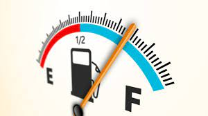

The fuel efficiency of vehicles is an important factor in our daily lives, affecting both our wallets and the environment. To gain insight into the fuel efficiency of various vehicle makes and models, this project analyzes data from the Geotab dataset. By combining actual fuel economy data from Geotab with expected fuel economy ratings from the EPA, we can explore the differences between actual and expected fuel economy for different vehicles.

Through this analysis, we aim to answer questions such as: Which vehicle makes and models perform better than expected in terms of fuel efficiency? Which models perform worse? How do these differences in fuel efficiency affect drivers and the environment?

By using data cleaning and manipulation techniques with pandas and data visualization tools with matplotlib and seaborn, we can explore the patterns and trends in the data, and gain insights into the factors that affect fuel efficiency. I hope that the results of this analysis will be useful for drivers, policymakers, and environmental advocates who seek to make informed decisions about transportation and sustainability.

The goal of this analysis is to gain insight into the differences between the actual fuel economy of vehicles and the fuel economy expected based on EPA ratings. By understanding these differences, we can better understand the factors that affect fuel efficiency and make more informed decisions when purchasing vehicles.

In this analysis, we will use pandas for data cleaning and manipulation, and matplotlib and seaborn for data visualization. We will explore the data through descriptive statistics and visualizations to gain a deeper understanding of the differences between actual and expected fuel economy. Our findings will be presented in this README and in the accompanying Jupyter Notebook.

I hope to provide a useful resource for those interested in fuel efficiency and the factors that impact it.

---

## Installation
To run this analysis, you will need to install the following libraries:

    pandas
    matplotlib
    seaborn
    
You can install these libraries using pip:

    pip install pandas matplotlib seaborn
    
---

## Usage
To reproduce the analysis, open the FuelEfficiencyAnalysis.ipynb notebook in Jupyter Notebook or Jupyter Lab. You can then run each cell in the notebook to execute the code and generate the visualizations.

---

## Data

This is a report of city vehicles and actual MPG compared to EPA estimated MPG. Each line of data is a combination of all the active vehicles on the city’s telematics system broken down into year/make/model/standard type with fueling and usage data. The intent is for each line to represent the sticker MPG and the real-world MPG and how these compare to each other

The data used in this analysis can be found in the Resources folder. 

he dataset used in this project contains information about the fuel efficiency of various vehicle makes and models. It includes data from the years 2008 to 2019 and includes both hybrid and non-hybrid vehicles.

The dataset includes the following features:

- YEAR: The year of the vehicle model

- MAKE: The make or manufacturer of the vehicle

- MODEL: The model name of the vehicle

- Hybrid/Non-Hybrid: Whether the vehicle is a hybrid or non-hybrid

- STANDARD TYPE: The type of vehicle (sedan, van, pickup, etc.)

- EPA RATING (CITY): The expected fuel economy rating for the vehicle in city driving conditions, as determined by the US 
Environmental Protection Agency (EPA)

- Vehicle Count: The number of vehicles of this make, model, and year in the dataset

- TOTAL ACTUAL MILES: The total number of miles driven by all vehicles of this make, model, and year in the dataset

- TOTAL ACTUAL FUEL: The total amount of fuel consumed by all vehicles of this make, model, and year in the dataset

- EPA EXPECTED FUEL: The total amount of fuel that would be expected to be consumed by all vehicles of this make, model, and year if they achieved the EPA rating

- ACTUAL FUEL ECONOMY Geotab: The actual fuel economy of all vehicles of this make, model, and year, as measured by Geotab, a telematics company

- PERCENT % DIFFERENCE ACTUAL TO EPA: The percentage difference between the actual fuel economy and the expected fuel economy as determined by the EPA

- ESTIMATED FUEL COSTS PER GALLON: The estimated cost of fuel per gallon based on the average fuel price at the time of data collection

- FUEL COSTS PER MILE: The cost of fuel per mile driven, calculated as the estimated fuel cost per gallon divided by the actual fuel economy.

The goal of this analysis is to explore the differences between the actual fuel economy of vehicles and the fuel economy expected based on EPA ratings, and to gain insights into the factors that affect fuel efficiency.

---

## Methods

The analytical methods used in this project include data cleaning and manipulation using pandas, and data visualization using matplotlib and seaborn. The analysis includes exploratory data analysis and statistical analysis of the differences between actual and expected fuel economy.

To begin the analysis, the first step was to clean and preprocess the dataset using the pandas library.

After cleaning the data, the exploratory data analysis was performed to gain insights into the distribution of the data and identify any trends or patterns. This included creating various visualizations such as scatter plots, barplots, and box plots.

To analyze the differences between actual and expected fuel economy, statistical analysis was conducted using descriptive statistics and hypothesis testing. The Shapiro-Wilk test was used to test for normality, and the Mann-Whitney U test was used to test for significant differences between groups.

Data visualization played an important role in this analysis, as it allowed for a clear presentation of the findings. The matplotlib and seaborn libraries were used to create various plots such as scatter plots, box plots, bar charts, line charts and heatmaps.

Overall, the combination of data cleaning, exploratory data analysis, statistical analysis, and data visualization provided a comprehensive understanding of the fuel efficiency of various vehicle makes and models. This analysis can be used to inform decision-making for drivers, policymakers, and environmental advocates who seek to make informed decisions about transportation and sustainability.

---

## Results
The analysis found that there is a significant difference between actual and expected fuel economy for many vehicles, with some models performing better than expected and others performing worse. The results are presented in the FuelEfficiencyAnalysis.ipynb notebook, along with visualizations of the data.

---

## Images

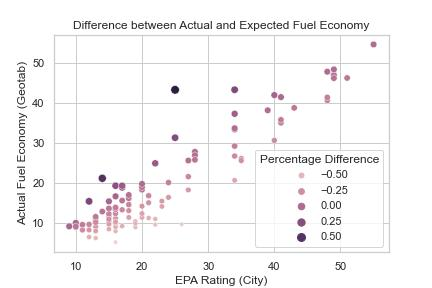

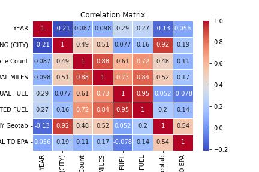

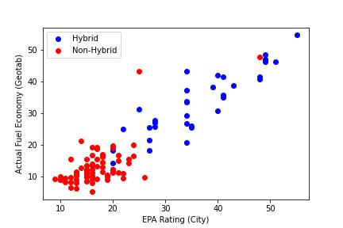

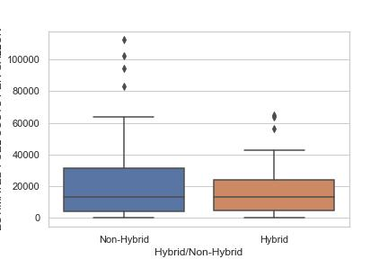

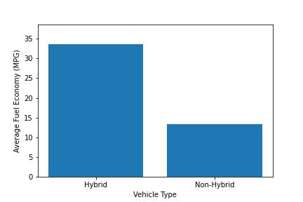

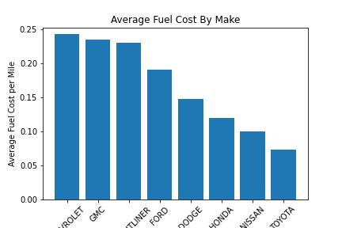

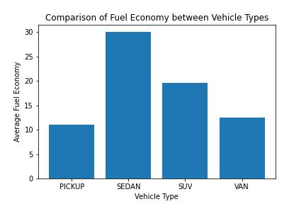

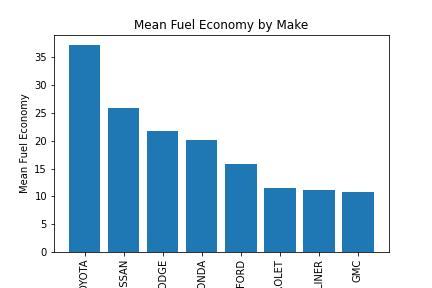

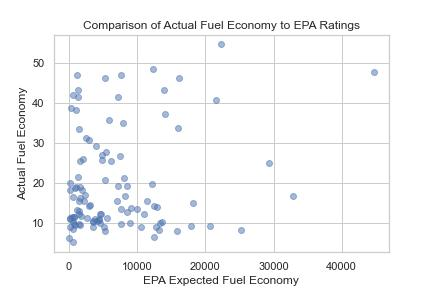

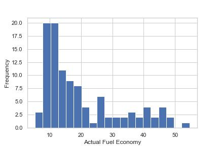

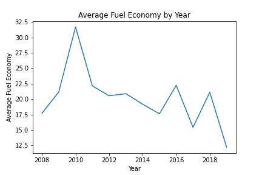

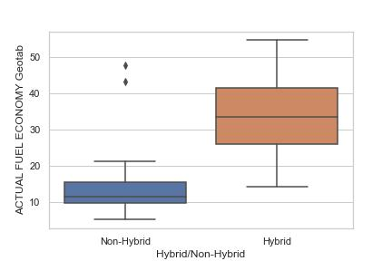

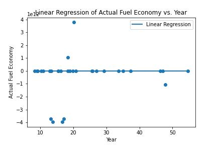

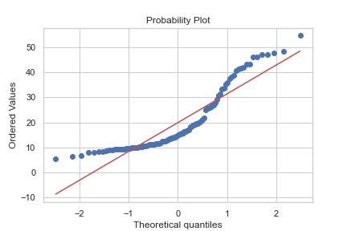

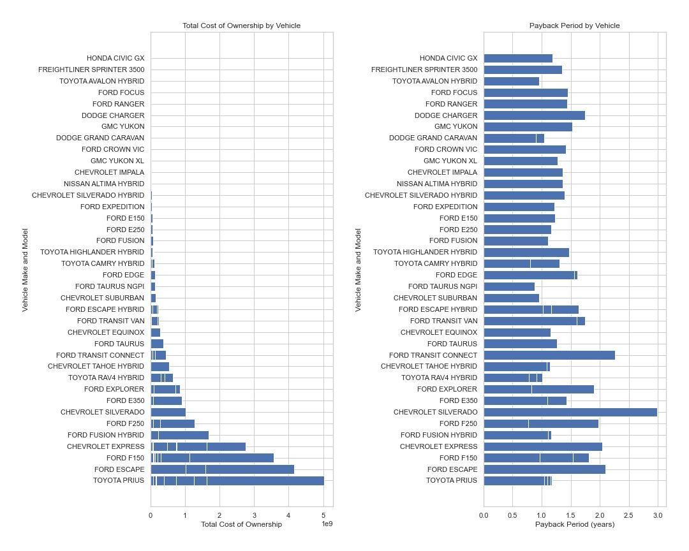
